## Analysis of Similar Solutions

### What our project is
Our project is an **all-in-one platform** for the padel ecosystem — a **hub app/website** where everything is centralized (community, booking, content, shop, tracking, etc).

### What is padel?
Padel is a racket sport played on a **small court** surrounded by **glass walls** (and metal fences). It looks like tennis, but it is more accessible and easier to learn.

### Why padel is exploding right now
Padel has been **growing massively over the last 4 years**, especially thanks to **social media exposure** and the fact that the sport is:
- **Easy to pick up** (low entry barrier)
- Often **more affordable** and accessible than tennis
- **Less physically demanding** at the beginning (you can enjoy it quickly without being extremely athletic)
- Extremely **social**: usually **4 players** on a court
- **Fast reward loop**: rallies are fun and points are quick, so you get motivation/dopamine fast

In short: **1 court + 4 players + a ball + rackets** is all you need to exercise and have fun with friends.

---

  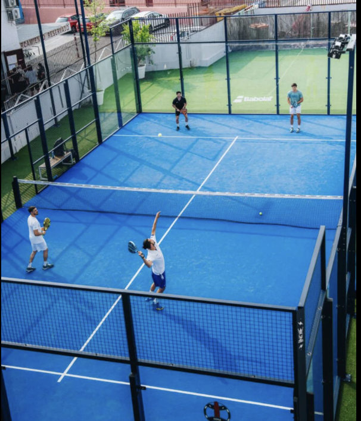
  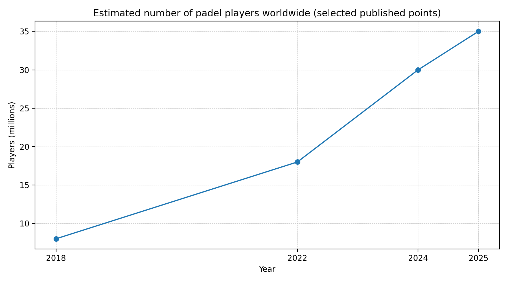

---

## Quick market overview
Quick graph showing some popular padel-related apps/websites on the market:

From our research, two important references are:

### Playtomic
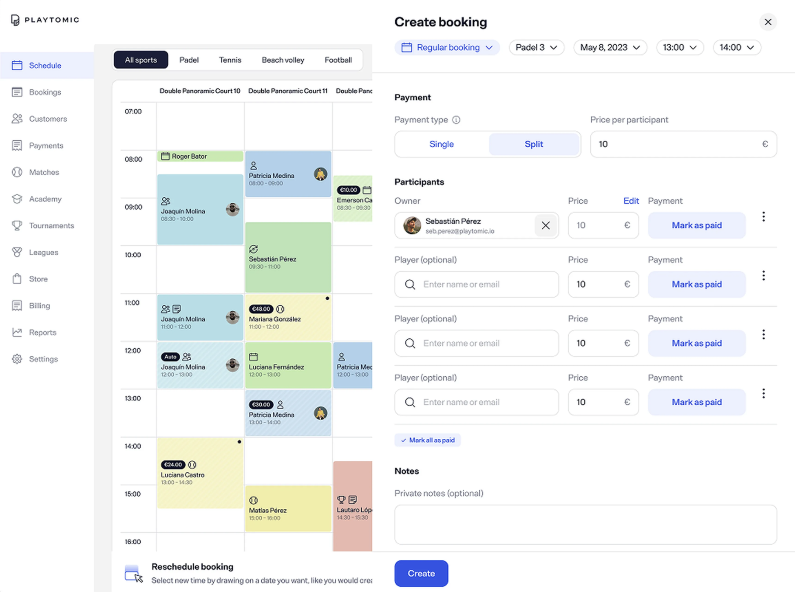

A major platform focused on:
- **Court booking**
- **Club planning**
- **Scheduling system**
A strong “booking-first” product approach.

### Playo
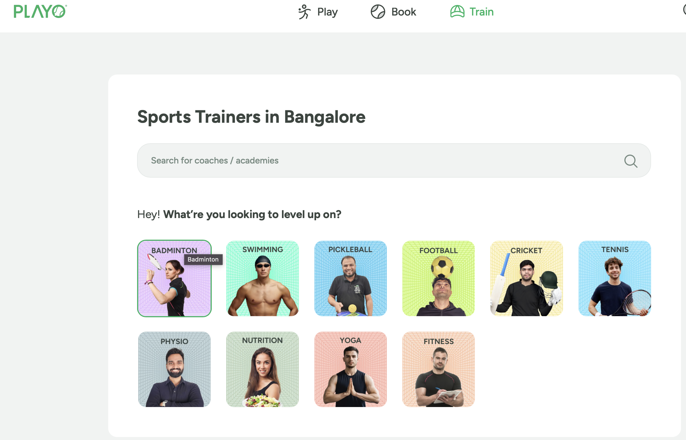

A **multi-sport app** (not purely padel-focused):
- Community features
- Activity organization
- Sports discovery
Broader target than padel.

---

## Existing app solutions (App Store examples)

### PADEL MATES

  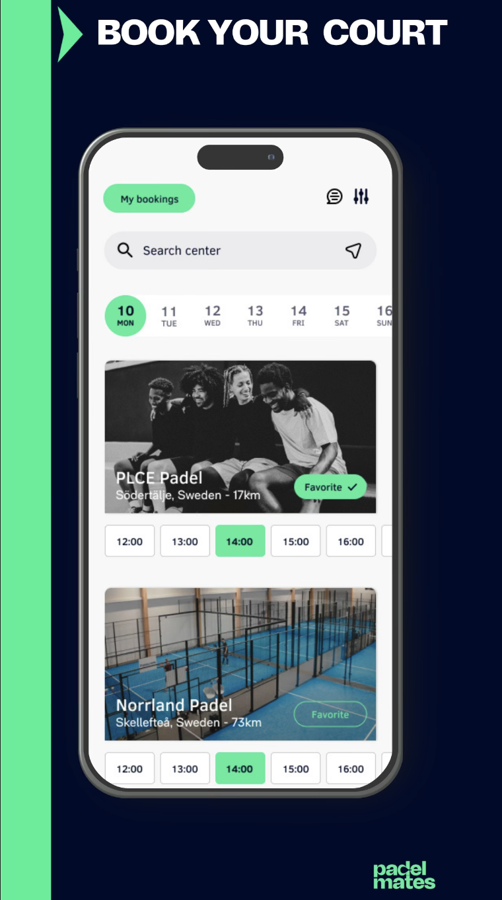
  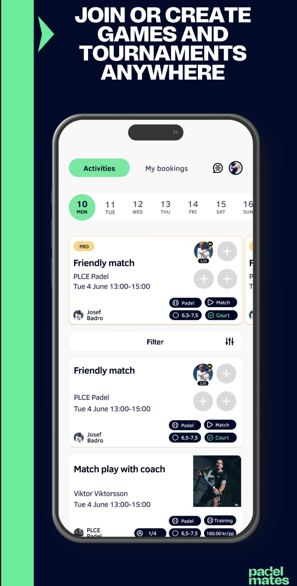
  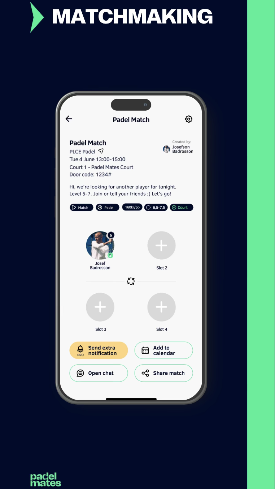
  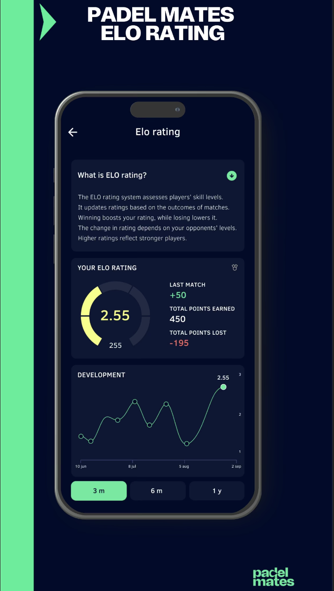
  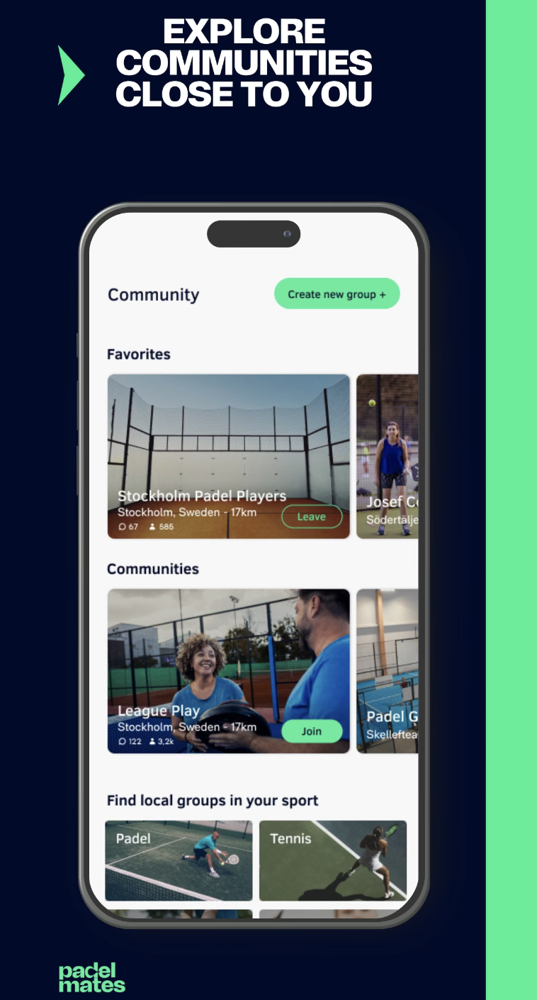
  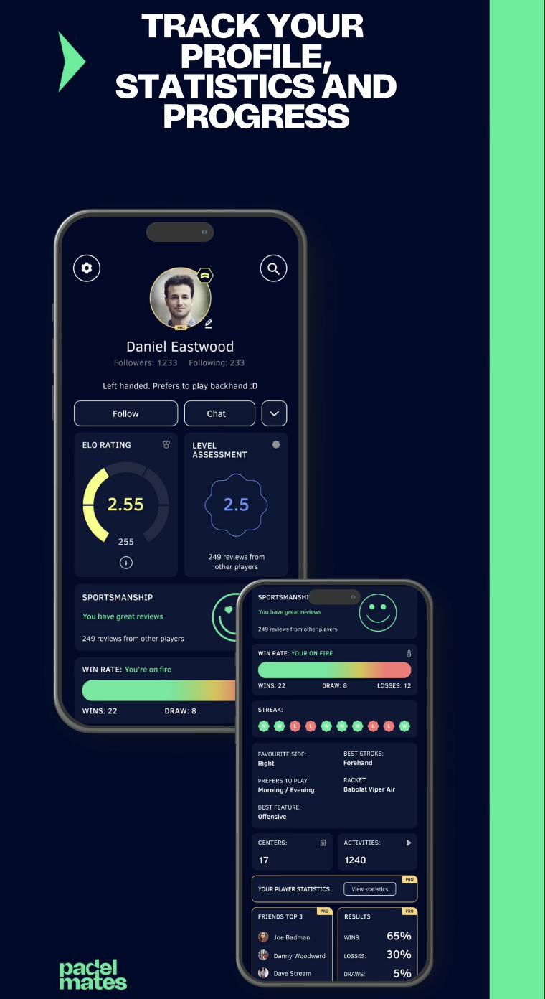

Padel Mates already covers several core features:
- **Booking**
- **Game creation**
- **Matchmaking**
- **Padel ELO rating**
- **Social feed / community**
- **Performance tracking / stats**

Strength: lots of features.  
Limitation: still not a full ecosystem (ex: shop + content + partners + full hub experience).

### 4PADEL

  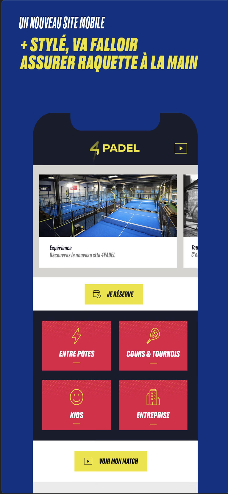
  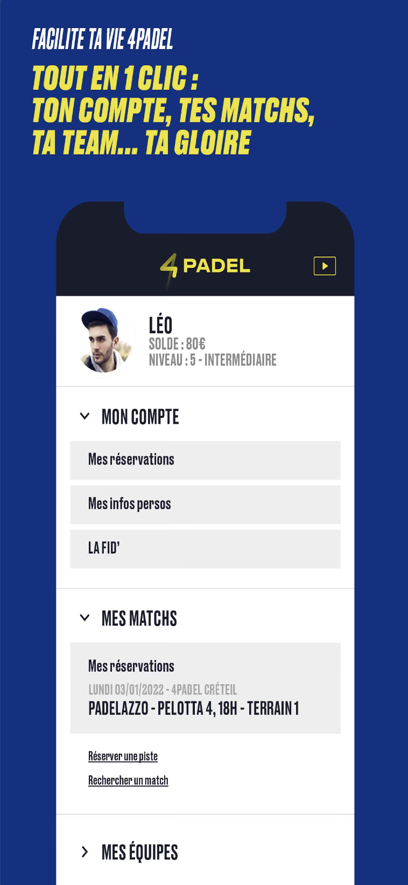
  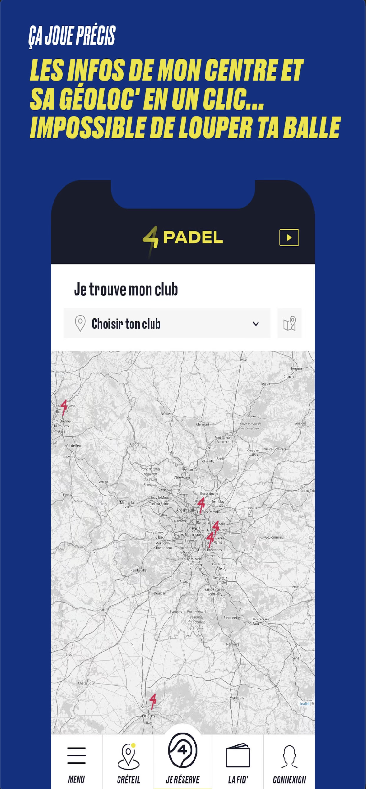
  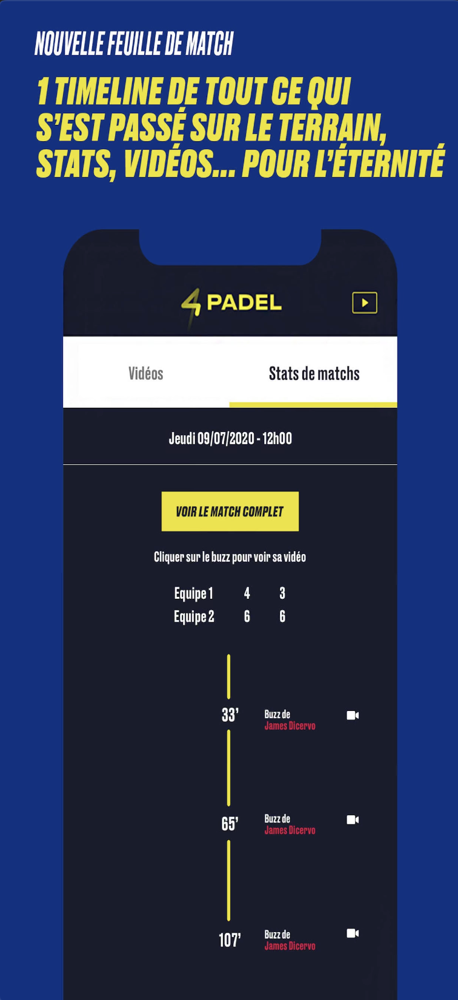

4PADEL looks more like a club network app focused on:
- **Booking pages**
- **User profile**
- **Map / club locations**
- **Match history**

Strength: simple and clear for club customers.  
Limitation: not a global hub, mainly for their own clubs.

---

## Conclusion from related solutions
Most existing products cover **only one part** of the padel experience:
- Booking-first platforms  
- Club-specific apps  
- Community apps  
- Tracking / ranking apps  

Our goal is to provide **everything in one place**, with one product experience:
**community + booking + content + shop + progression + discovery**.

---

## Identification of Differentiating Points

### 1) A true “Padel Super-App” (one account, one ecosystem)
Instead of switching between different apps (booking, stats, social, shop…), users get:
- one profile
- one identity
- one history
- one feed
- one progression system  
Everything is connected.

### 2) Scroll-first experience (TikTok/IG style) but padel-focused
Most padel apps feel like “tools”. We want a modern content platform:
- Short-form clips (highlights, rallies, tips)
- Local content (clubs near you, players nearby, events)
- Follow players, clubs, coaches
- Personalized feed based on your activity  
Padel grows through social media, so the app should feel like social media.

### 3) Booking + games + matchmaking integrated with real social features
We unify:
- book a court
- instantly create a game
- invite friends or open it to nearby players
- auto-balance teams using ELO / skill level
- post match results automatically
- generate stats and progression  
A continuous loop: **discover → play → record → share → improve → repeat**.

### 4) Player progression system (simple and motivating, not only ELO)
ELO can be too “cold”. We can add:
- levels / badges
- weekly challenges (missions)
- streaks
- training packs (coach plans)
- match insights (what to improve)  
This increases retention.

### 5) Marketplace / shop connected to the community
Not just a shop tab:
- gear recommendations based on level/style
- club deals and partner offers
- coach services and lessons
- tournament registrations
- brand collaborations

### 6) Local-first network (where padel actually happens)
Padel is local, so the app should highlight:
- courts near you
- open games near you
- players near you
- events / tournaments
- club announcements and posts

### 7) Club and creator tools (B2B + growth engine)
If we give clubs and creators tools to grow:
- club pages, offers, announcements
- creator profiles, monetization, coach booking
- event management  
Then clubs and creators will promote the app themselves.
