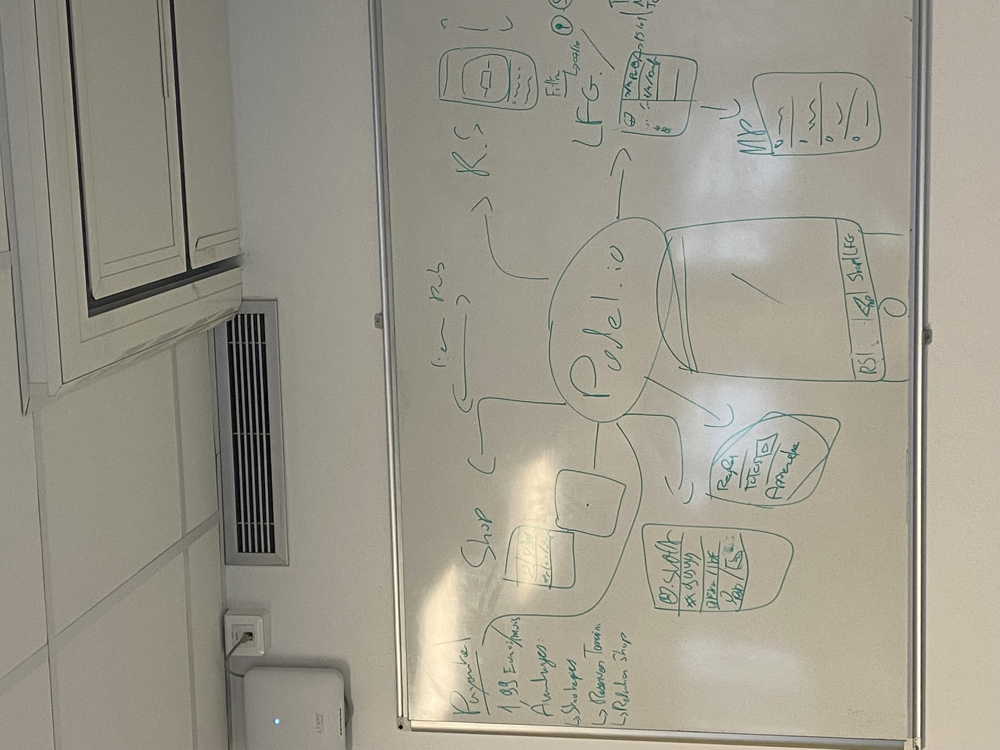

## Our First Views

  

## Links Figma and Canva

 canva ; https://www.canva.com/design/DAG_DHKWXos/yeZAMvD-Ahz9-_hIdL3DaA/edit?utm_content=DAG_DHKWXos&utm_campaign=designshare&utm_medium=link2&utm_source=sharebutton

figma :https://www.figma.com/design/nsnF5cxknxaF5y4UtdTyvq/Padel-hub?node-id=0-1&t=CsdttGSRjhP5OGuF-1
## Objectives, Assumptions, Risks, and Constraints

### Measurable Objectives
- Allow a user to create a padel game in less than 60 seconds (time + location + level + open/invite).
- Reach all created games that are fully filled (4 players) using the app matchmaking system.
- Reduce no-shows by adding confirmations, reminder and punishing fee to avoird  no-show rate on open games.
- Let a user book a court in less than 3 minutes .
- Track match history.
- Get at least 3 clubs onboarded for a pilot ( accept bookings or requests).

---
### non Measurable Objectives
- Link with International Padel Federation (IPF), official and worldwide ranking system.
- Users from all over the world (bc 50% user are hispanic and dont understand well English)
- Collaboration with big Brands
---
### Assumptions
- Padel players want one place for booking, games, and social features instead of multiple apps.
- Users will accept sharing basic data (location, level, availability) to improve matchmaking.
- Clubs will be open to visibility and booking integration if it brings them more players.
- A simple rating system (beginner/intermediate/advanced or ELO) is enough at MVP stage.
- Users are more likely to stay if the app provides a fast loop: find → play → save results → play again.

---

### Risks
- Booking integration is hard because clubs use different systems or do not want external tools.
- Matchmaking can fail if there are not enough users in the same area (cold start problem).
- Rating/ELO can create frustration if it feels unfair or if players “smurf”.
- Too many features can make the app complex and reduce adoption (scope creep).
- Legal/privacy risk if user data is not handled correctly 
- Content moderation risk if the social feed is misused (spam, toxic behavior).

---

### Constraints
- Team size constraint
- Budget constraint
- Data constraint: we do not own official match data; users must enter results manually in MVP.
- Moderation constraint: social features must start simple to avoid heavy moderation workload.
