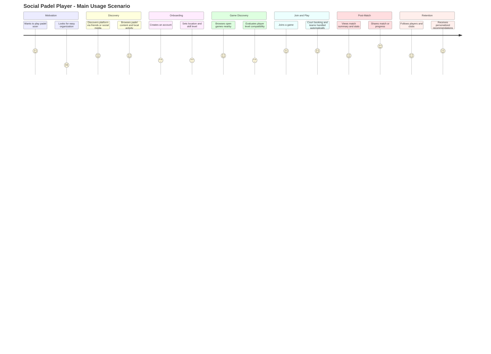

# User Journey Diagram — Social Padel Player

```mermaid
journey
  title Social Padel Player - Main Usage Scenario

  section Motivation
    Wants to play padel soon: 5
    Looks for easy organization: 2

  section Discovery
    Discovers platform via friends or social media: 4
    Browses padel content and local activity: 4

  section Onboarding
    Creates an account: 3
    Sets location and skill level: 3

  section Game Discovery
    Browses open games nearby: 4
    Evaluates player level compatibility: 3

  section Join and Play
    Joins a game: 5
    Court booking and teams handled automatically: 5

  section Post-Match
    Views match summary and stats: 4
    Shares match or progress: 6

  section Retention
    Follows players and clubs: 4
    Receives personalized recommendations: 5
```
