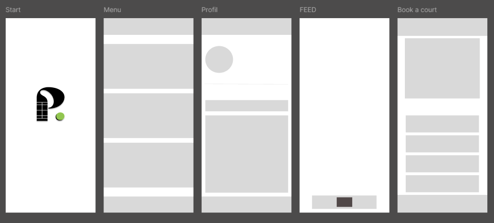
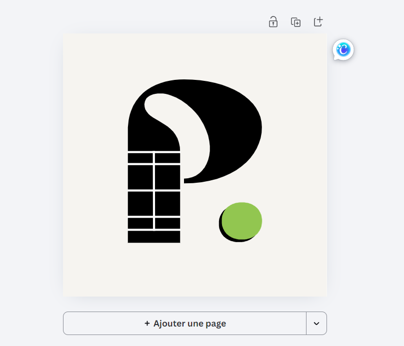

# Wireframes 

For Padel.hub the idea was to make an easy to navigate and modern looking app, we went for a simple navigation bar and easy UX in the menu to achieve everything the user have to easily and fast.

# Ideas

We made low fidelity examples of what we wanted the app to look like on figma.

  

&nbsp;

For the logo we made it ourselves, the first idea was to represent padel.hub with the "P" and the "." as a padel ball, then we went for the padel court illustration inside the P to fully cover the idea of our app and make the logo as clear as possible while still being modern and minimalist

  

&nbsp;

For the color we choose to have a defining green/yellow on our app "#92c650" (the padel ball color in the logo)

