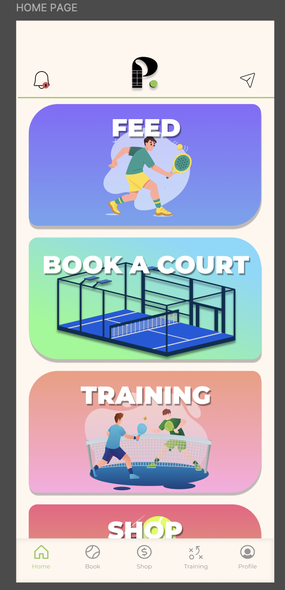
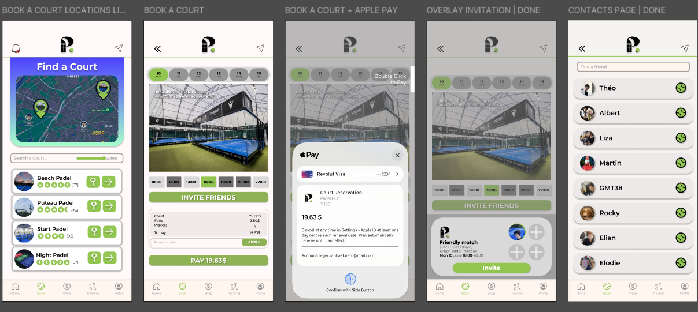
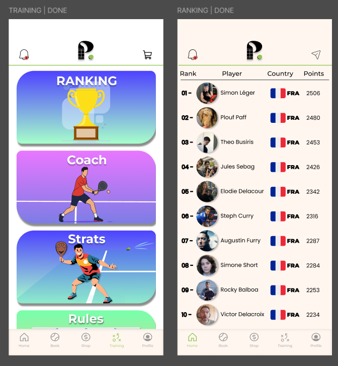
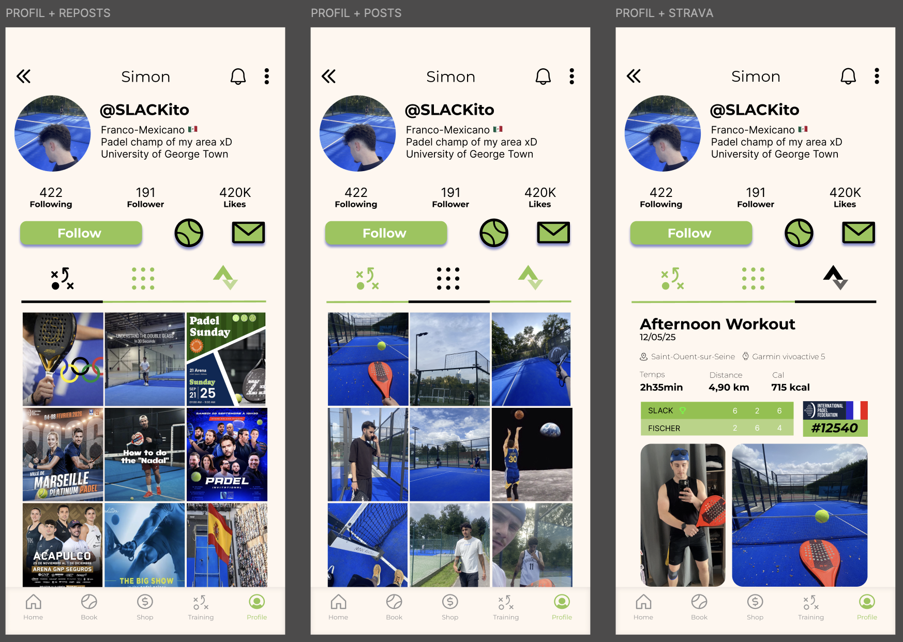
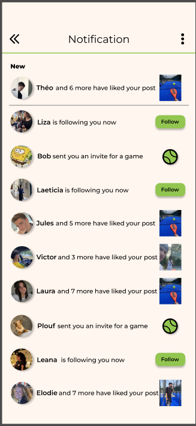

# Mockups 

For the mockups we used Figma and based on the ideas and the wireframes we choose to to have a minimalist design with color matching and easy to understand UI.

  

  The login/register page is modern and minimalist to make it easier to use

  
  

  The main menu is detailed and colorful while keeping the navigation bar and the header in a modern design with the key color being the green/yellow of the logo #92c650

  
  

  Both "find a court" and "find a coach" are very important for the app, its the key role of the application and need to be easy to handle and very user friendly ( with big button, map to plan the match easily , ect)

  

  Ranking is a siple page needed in padel where the international padel federation rules the ranking.

  

  The profile page is similar to other social media profile page, its here to easily handle links between users and is also used for the feed part of the app

  
  

&nbsp;