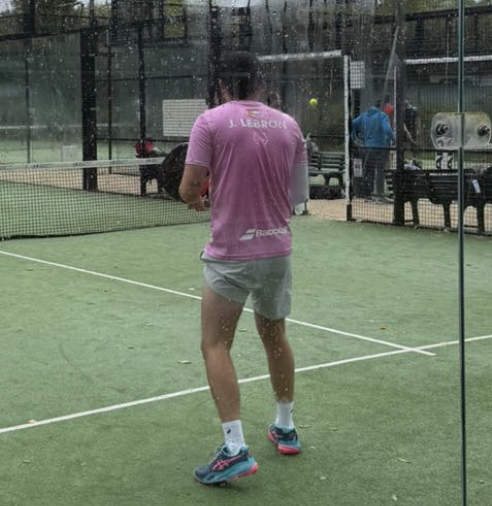

## Context

You are testing a Figma prototype of a padel social app.
There is no real functionality: your goal is to explore the screens, navigate freely, and share your impressions.

Think of this as visiting a product for the first time.

## Instructions for testers

- Navigate through the prototype as naturally as possible
- Click where it feels logical
- Take time to observe layouts, transitions, and visual hierarchy
- There are no right or wrong actions
- Your role is to react, not to validate technical behavior.

## Screens & features to explore

- Login & Register screens
- Feed and post screens
- Following / social interactions
- Party (game) creation and discovery
- Ranking / progression
- Shop (discovery only)

## What to pay attention to

- While exploring, note things like:
- What feels clear and intuitive
- What feels confusing or unclear
- Screens that look appealing vs less appealing
- Moments where you hesitate or don’t know where to click
- Visual elements that help (or don’t help) understanding
- Overall first impression of the app

# You can express feedback freely, for example:

    - “This screen feels nice / overwhelming / empty”, or “I immediately understood this” or “I don’t really get what this is for”

## Feedback format

At the end, share a short report with:

- What you liked
- What felt less appealing
- Any confusing screens or transitions
- General thoughts about the product and its vibe
   ## REAL FEEDBACK 

WE actually send a message with  a link and a code to several friends of  us that played padel . 

**Theo Humbert**
Enthusiast padel french Player 

<audio controls preload="auto">
  <source src="./assets/audio/interviewTheo.mp3" type="audio/mpeg">
  Your browser does not support the audio element. Téléchargez le fichier ici : ./assets/audio/interviewTheo.mp3
</audio>

 Or listen in an other file : <a href="./assets/audio/interviewTheo.mp3" target="_blank" rel="noopener">Links feedback (MP3)</a>

