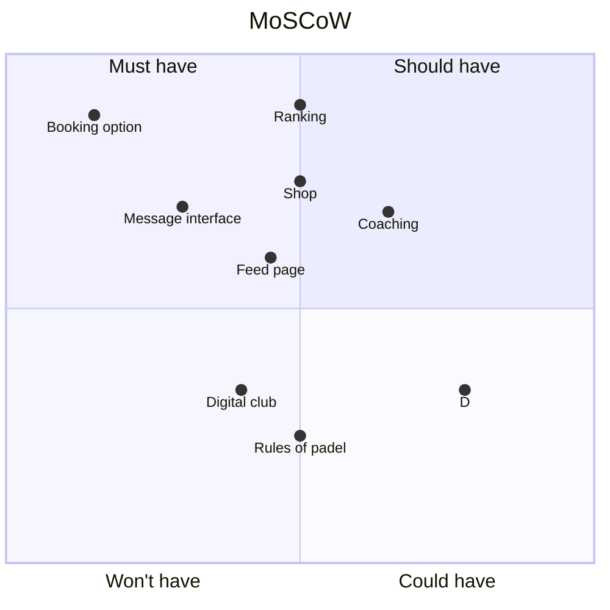

# Moscow matrix about the features of padel hub.

Just above you can see a diagram, let me break it down for you.

### Booking option 
We consider this the main feature of the application, the main point of it is to help peoples organize their sessions easily.
It needs to meets two requirements.

- Firstly, creating a party to play, inviting or responding to an invitation must be easy, pleasing to the eyes and smooth.
- Secondly, choosing a club, picking an hour and paying to secure a reservation must meet the same criterias. (simplicity, appealing...)

---

### Appealing message interface 
Since users are supposed to spend a lot of times messaging each other to organize their sessions it must be pleasant and easy to send an invitation to a game, the flow of it must be really really easy and indicated correctly.

---

### Shop 

The shop is not as essential as the booking option for the users but it will be the main income of the application with a system of commission for the products.\
This page must be appealing too and the quality of the equipments must be verified seriously to ensure the good reputation of the application, meaning any partner must be validated through a solid process.

---

### Ranking

The ranking system will be a very important feature because it will establish a clear system that can be used outside the application (either based on official ranking or intern to the application based on win and losses in matches registered on it).
It will help users measure to each others and give them a reason to play a lot, using all the functions of the application (shop for better gear, coaching to perform better...).
It's not essential but it is a great feature to have, even if it means a great work load to keep it updated and clean.

---

### Coaching 

The coaching part of the application would be very much appreciable, taking a fee to the coach for beeing proposed to users would earn another income and permit to keep the application free and bring in more users.\
To ensure quality the fee must include a validation of a certain level and/or diploma to provide lesson.

---

### Feed 

The feed page can be a strong tool to keep users on the application for long time, meaning ad revenue and better user engagement.
It will be important to post their achievements and results to have a competitive side and social side to the application.
However we don't want to be like other social app and this should not be too invasive and really oriented to be padel related.

---

### Rules 

This page was a good idea for beginner so they could see all the rule but since it will be used only once the utility is questionnable and maybe render the whole thing a bit heavy for nothing in the interface.\
We don't want user to be lost or drowned in the feed so while it can be useful it's not certain that it will be keep in the final product.

---

### Digital club 

Originally the idea was to create a sort of "clan" based on real padel club where you could subscribe and find other people from your club but even if it could be a cool feature we decided that it make more sense to have club create an account to post and organize tournament directly instead of another page wich would be a bit pointless.